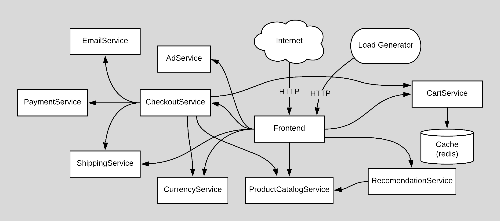

**[Online Boutique](https://microservices.honeydemo.io)** is a cloud-native microservices demo application. Online
Boutique consists of a 10-tier microservices application, writen in 5 different languages: Go, Java, .NET, Node, and
Python. The application is a web-based e-commerce platform where users can browse items, add them to a cart, and
purchase them.

**[Honeycomb](https://honeycomb.io)** uses this application to demonstrate use of technologies like Kubernetes, gRPC,
and OpenTelemetry. This application works on any Kubernetes cluster. It’s **easy to deploy with little to no
configuration**.

## OpenTelemetry

Online Boutique is instrumented using the [OpenTelemetry](https://opentelemetry.io) framework. There are simple and
advanced instrumentation techniques offered by OpenTelemetry that are leveraged in the application. Each service in
the [src](./src) folder explains how OpenTelemetry was used with specific code examples.

## Table of Contents

- [Development](#development)
  - [Prerequisites](#prerequisites)
  - [Kubernetes Quickstart](#kubernetes-quickstart)
  - [Cleanup](#cleanup)
- [Architecture](#architecture)
- [Features](#features)
- [History](#history)
- [Application demo](#application-demo)

## Development

### Prerequisites

- [Docker for Desktop](https://www.docker.com/products/docker-desktop)
- [kubectl](https://kubernetes.io/docs/tasks/tools/#kubectl), a CLI to interact with Kubernetes
- [skaffold](https://skaffold.dev/docs/install/), a tool that builds and deploys Docker images in bulk
- [Helm](https://helm.sh), a package manager for Kubernetes

### Kubernetes Quickstart

1. Launch Kubernetes cluster with Docker Desktop or Minikube:

   1. Launch **Docker Desktop**. Go to Preferences:
      - choose “Enable Kubernetes”,
      - set CPUs to at least 3, and Memory to at least 6.0 GiB
      - on the "Disk" tab, set at least 32 GB disk space
   2. To launch **Minikube** (tested with Ubuntu Linux). Please, ensure that the local Kubernetes cluster has at least:
      - 4 CPUs
      - 4.0 GiB memory
      - 32 GB disk space
      ```shell
      minikube start --cpus=4 --memory 4096 --disk-size 32g
      ```

2. Run `kubectl get nodes` to verify you're connected to the respective control plane.

3. Install the [OpenTelemetry Collector Helm chart](https://opentelemetry.io/docs/kubernetes/helm/collector/).

```shell
helm repo add open-telemetry https://open-telemetry.github.io/opentelemetry-helm-charts

helm install opentelemetry-collector open-telemetry/opentelemetry-collector \
   --set mode=deployment \
   --set image.repository="otel/opentelemetry-collector-k8s" \
 --values ./kubernetes-manifests/additional_resources/opentelemetry-collector-values.yaml
```

4. Run `skaffold run` (Note: first time will be slow, it can take ~20 minutes). This will build and deploy the application.
   If you need to rebuild the images automatically as you refactor the code, run `skaffold dev` command.

5. Run `kubectl get pods` to verify the Pods are ready and running.

6. Access the web frontend through your browser.
   1. **Docker For Desktop** should automatically provide the frontend at http://localhost:80
   2. **Minikube** will require you to run `minikube service frontend-external` to access the frontend.

### Cleanup

If you've deployed the application with `skaffold run` command, you can run `skaffold delete` to clean up the deployed resources.

## Architecture

**Online Boutique** is composed of 10 microservices (plus a load generator) written in 5 different languages that communicate with each other over gRPC.

[](./docs/img/architecture-diagram.png)

Find **Protocol Buffers Descriptions** at the [`./pb` directory](./pb).

| Service                                              | Language      | Description                                                                                                                       |
| ---------------------------------------------------- | ------------- | --------------------------------------------------------------------------------------------------------------------------------- |
| [adservice](./src/adservice)                         | Java          | Provides text ads based on given context words.                                                                                   |
| [cartservice](./src/cartservice)                     | C#            | Stores the items in the user's shopping cart in Redis and retrieves it.                                                           |
| [checkoutservice](./src/checkoutservice)             | Go            | Retrieves user cart, prepares order and orchestrates the payment, shipping and the email notification.                            |
| [currencyservice](./src/currencyservice)             | Node.js       | Converts one money amount to another currency. Uses real values fetched from European Central Bank. It's the highest QPS service. |
| [emailservice](./src/emailservice)                   | Python        | Sends users an order confirmation email (mock).                                                                                   |
| [frontend](./src/frontend)                           | Go            | Exposes an HTTP server to serve the website. Does not require signup/login and generates session IDs for all users automatically. |
| [loadgenerator](./src/loadgenerator)                 | Python/Locust | Continuously sends requests imitating realistic user shopping flows to the frontend.                                              |
| [paymentservice](./src/paymentservice)               | Node.js       | Charges the given credit card info (mock) with the given amount and returns a transaction ID.                                     |
| [productcatalogservice](./src/productcatalogservice) | Go            | Provides the list of products from a JSON file and ability to search products and get individual products.                        |
| [recommendationservice](./src/recommendationservice) | Python        | Recommends other products based on what's given in the cart.                                                                      |
| [shippingservice](./src/shippingservice)             | Go            | Gives shipping cost estimates based on the shopping cart. Ships items to the given address (mock)                                 |

## Features

- **[Kubernetes](https://kubernetes.io):**
  The app is designed to run on Kubernetes
- **[gRPC](https://grpc.io):** Microservices use a high volume of gRPC calls to communicate to each other.
- **[OpenTelemetry](https://opentelemetry.io/) Tracing:** Most services are instrumented using OpenTelemetry trace
  providers for gRPC/HTTP.
- **[Skaffold](https://skaffold.dev):** Application is deployed to Kubernetes with a single command using Skaffold.
- **Synthetic Load Generation:** The application demo comes with a background job that creates realistic usage patterns
  on the website using
  [Locust](https://locust.io/) load generator.

## History

This project originated from the excellent Google Cloud
Platform [Microservices Demo](https://github.com/GoogleCloudPlatform/microservices-demo). It was forked in 2021, before
significant changes were performed. All application telemetry which was previously done with OpenCensus and Stackdriver,
was moved to use [OpenTelemetry](https://opentelemetry.io) for application telemetry, with tracing export intended for
an OpenTelemetry Collector. Additional instrumentation is leveraged throughout the application to show some basic and
advanced capabilities of OpenTelemetry. This application is used as a demo platform for the Honeycomb team, and many
changes were made to the application code so it will break in ways that make for a more compelling demonstration of the
Honeycomb platform.

## Application demo

This application will exhibit a problem meant to be discovered with ease using the [Honeycomb](https://honeycomb.io)
platform.

The checkout service has a memory leak, caused by an internal cache store. This service has tight Kubernetes
pod/container memory limits, so the leak will cause out of memory crashes, resulting in a pod restart after
approximately 4 hours. Code in the checkout service will introduce additional delays in the form of SQL calls
under `getDiscounts`. The number of SQL calls made will increase as the cache size increases, creating exponentially
increasing latency. There is additional code in the frontend service, which will introduce a specific userid (20109)
after the cache limit from checkout has reached a specific threshold. This results in a pattern where a single user from
a pool of thousands, receiving a bad experience that continues to get worse.

When using Honeycomb BubbleUp, and combined with the Honeycomb SLO feature, understanding the single user from the high
cardinality pool of thousands of user ids is easy to do. Honeycomb allows the user to ask novel questions from the data,
to quickly understand the memory leak and cache problem in code.

---

**This is not an official Honeycomb or Google project.**
